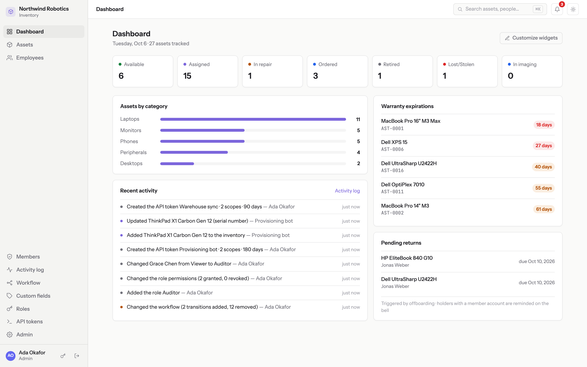
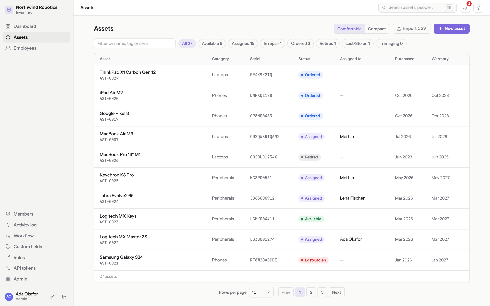
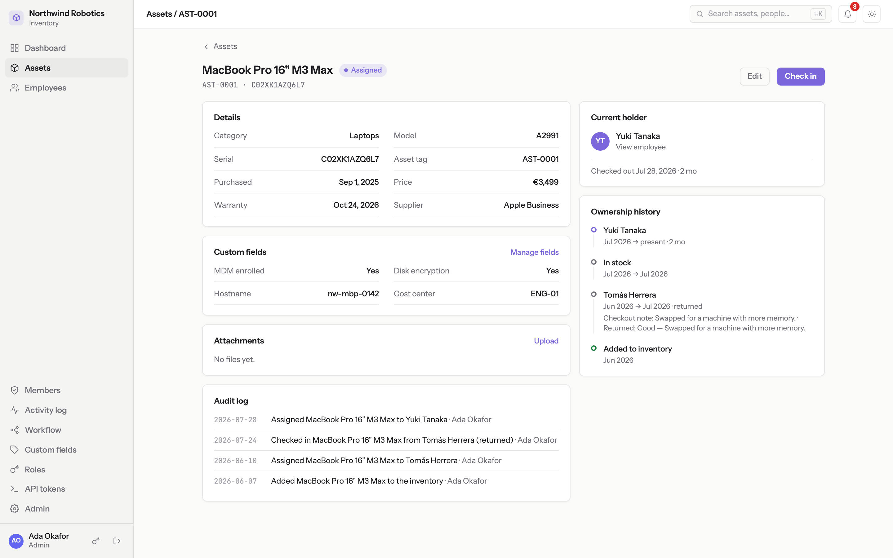
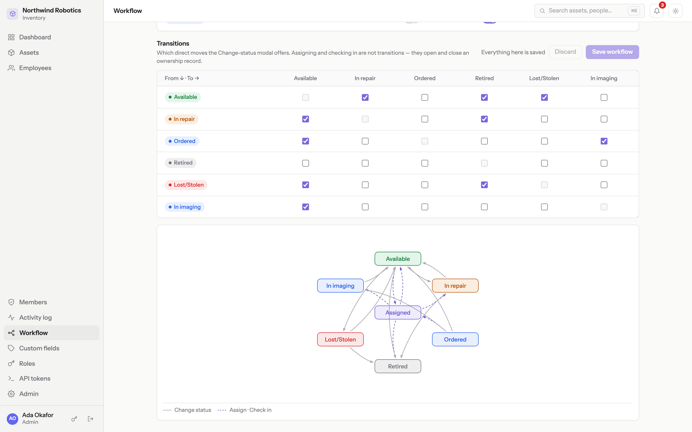
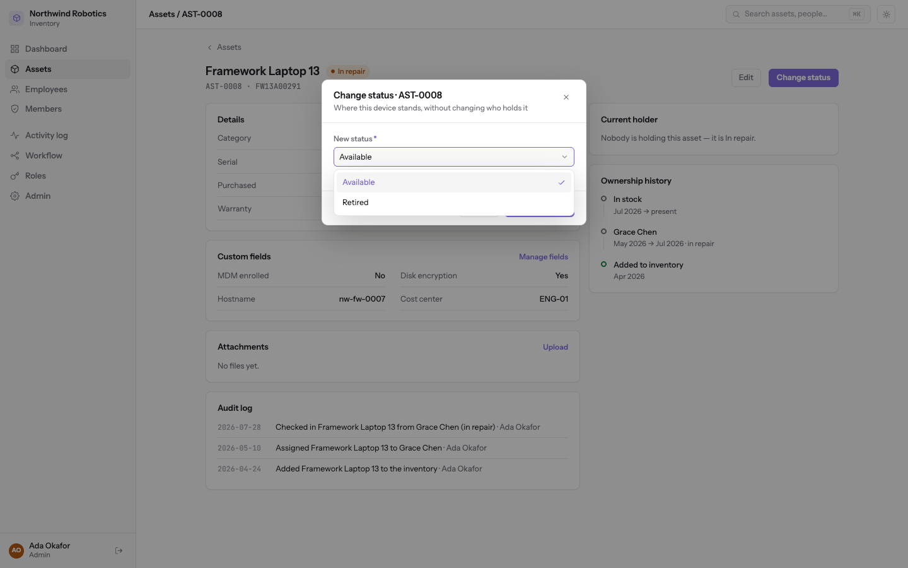
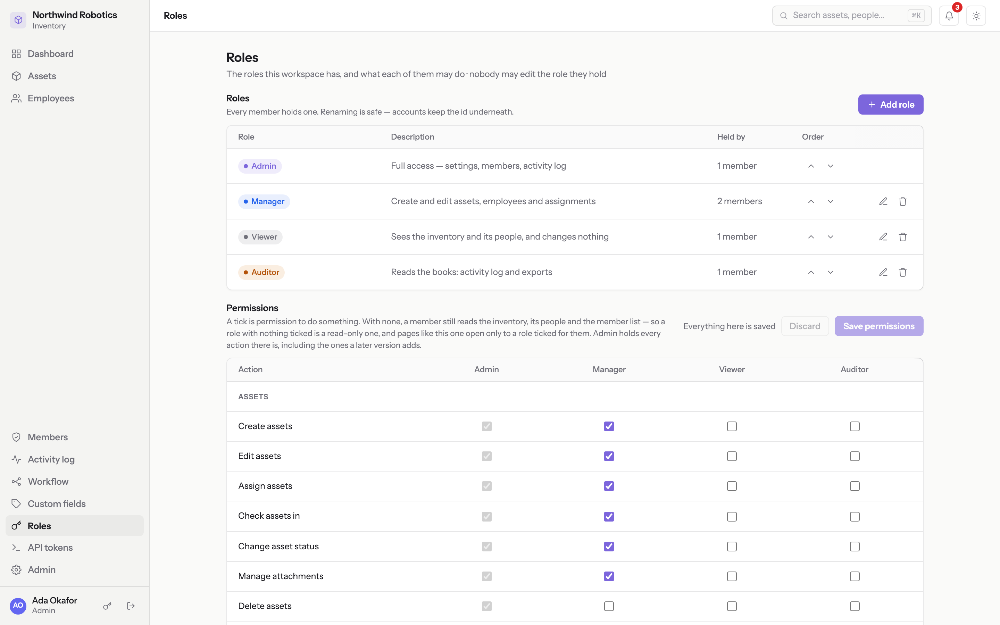
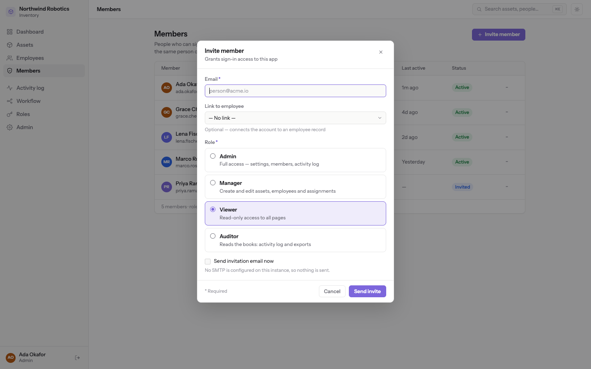
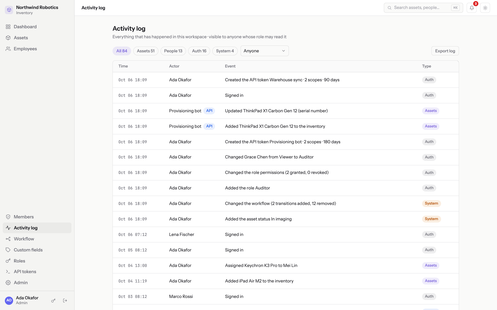
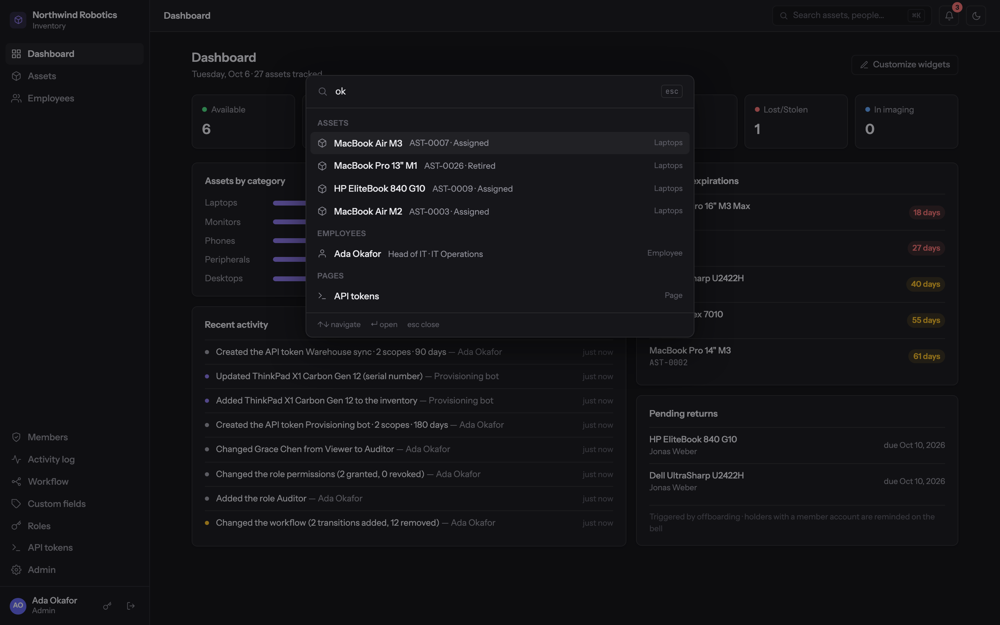
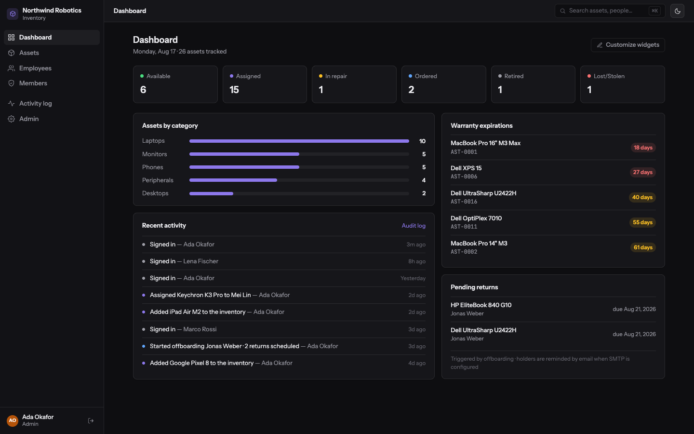

<h1 align="center">Hardware assets tracking system</h1>

A self-hosted, MIT-licensed inventory for IT teams: the devices you own, who holds each one, and the full ownership history of every one. The whole install is one container over one directory, and every setting has a default — when one machine stops being enough, `DATABASE_URL` moves the rows to PostgreSQL and `S3_BUCKET` moves the attachments to a bucket.

## Table of contents

1. [Quick start](#quick-start)
2. [What it is](#what-it-is)
3. [Three ways to run it](#three-ways-to-run-it) — [Demo](#demo) · [Production light](#production-light) · [Full scale](#full-scale)
4. [Configuration](#configuration) — [Invitations and recovery](#invitations-and-recovery) · [Integrating](#integrating) · [Backup and restore](#backup-and-restore)
5. [Security](#security) — [Two-factor authentication](#two-factor-authentication)
6. [Development](#development)
7. [Screenshots](#screenshots)
8. [License](#license)

## Quick start

```bash
mkdir -p data
docker run -d --name inventory -p 3000:3000 -v ./data:/data ghcr.io/mikhailbahdashych/hardware-assets-inventory-tool:latest
# then open http://localhost:3000 — the first screen creates your organization and its first admin
```

## What it is

- **Assets** — tag, name, category, serial, status, purchase, warranty, supplier, notes, attachments and any custom fields you define. Filters live in the URL, so a filtered view is a link.
- **Employees** — the people who hold devices, separate from the accounts that sign in and optionally linked to one, because most staff never need a login.
- **Ownership history** — who had what, when, and how it came back, in one table that is the only truth about it: an asset's status and its open ownership record cannot disagree.
- **Your own workflow** — an admin adds, renames, recolours and reorders the statuses an asset can be in, and draws the allowed moves as a checkbox matrix with a live diagram. The API enforces the graph, not just the UI.
- **Your own roles** — an admin invents roles and ticks what each may do in a matrix of every action. Admin is the one locked row; a grant lands on that member's next click.
- **Members and invitations** — the accounts that sign in, invited with a copyable link.
- **Attachments** — invoices, photos, repair reports: twenty-four file types (not SVG), 10 MB each, under a workspace quota.
- **Activity log** — every mutation as a sentence, filterable by type and by who acted, exportable as CSV.
- **Dashboard**, **⌘K** search and commands, and **CSV import** with a dry run that names the row and column of every problem.
- **An inbox, not an email server** — warranty alerts, return reminders and hand-over notices land on a bell in the app, so there is no SMTP to configure.
- **An API for other systems** — scoped tokens on a curated `/api/public/v1`, with its reference generated from the running routes.
- **Two-factor authentication** — TOTP for the whole workspace, recovery codes, and a break-glass command.

## Three ways to run it

One image, the same features in all three; what differs is where the rows and the files live. **Demo** is a checkout on your laptop. **Production light** — one container, one volume, a reverse proxy, a small VM — is what this product is for. **Full scale** is the same container with RDS and S3 behind it, stood up by Terraform.

### Demo

```bash
git clone https://github.com/mikhailbahdashych/hardware-assets-inventory-tool.git
cd hardware-assets-inventory-tool
npm install
npm run seed:demo     # optional: a fictional company with four months of history
npm run dev           # → http://localhost:5173
```

Node 22+. Open `:5173` (Vite, which proxies the API on `:3000`). The demo seed prints one login per role, dates everything relative to today so warranties are always about to lapse, and refuses a workspace that has data unless you pass `-- --reset`. Only Docker installed? [`docs/development.md`](docs/development.md) has that route.

**This repo is built to be customized by asking Claude Code.** Every area carries a `CLAUDE.md` explaining its patterns, and [`docs/recipes/`](docs/recipes/README.md) has checklists for the changes teams make — a new field, a new page, a new permission.

### Production light

```bash
curl -O https://raw.githubusercontent.com/mikhailbahdashych/hardware-assets-inventory-tool/main/docker-compose.yml
mkdir -p data
docker compose up -d
```

Open <http://localhost:3000>: the first screen creates your organization and its first admin. Then, before it is on the internet:

- **Put it behind a reverse proxy for TLS and set `APP_URL` to the public address.** [`docs/deployment.md`](docs/deployment.md) is the whole procedure — DNS, the proxy contract, Caddy and nginx blocks, firewall, backups, upgrades, health.
- **Pin a version.** Releases publish `:X.Y.Z`, `:X.Y` and `:latest` (amd64 and arm64); `:latest` is for trying it, a pinned tag is for running it.
- **Single replica.** The scheduler runs in-process, so two containers would both fire the nightly jobs. Scale the machine, not the count.
- **Nothing in the container runs as root**, so the data directory must be writable by uid 1000: create `./data` yourself, or `chown -R 1000:1000 ./data`. A container that cannot write it says so and prints the fix.

**Upgrading is `docker compose pull && docker compose up -d`** — migrations run at boot. Read [Upgrades](docs/deployment.md#upgrades) in the deployment guide first: it covers release notes, coming from v0.1.0/v0.2.0, and the boot line that confirms what the instance engaged.

### Full scale

When one machine stops being the answer — more people than one process should serve, attachments outgrowing a disk, a database that must be managed — [`infrastructure/`](infrastructure/README.md) is flat Terraform for AWS: a VPC without a NAT gateway, an EC2 instance running this image, RDS PostgreSQL 17 and a private versioned S3 bucket. 32 resources at apply and **about $40 a month**.

Nothing in the app changes; the stack exists to produce `DATABASE_URL` and `S3_BUCKET` correctly. It ends at plain HTTP on an Elastic IP — the domain, proxy and TLS are your own edge. **There is no automated SQLite → PostgreSQL data path before 1.0**, so choose the engine when you stand the instance up ([Moving up](docs/deployment.md#moving-up)). Read the infrastructure README's [Tearing it down](infrastructure/README.md#tearing-it-down) before the first apply.

## Configuration

Every value has a default; an instance with no configuration runs.

| Variable              | Default                          | What it does                                                                                                                                                                                |
| --------------------- | -------------------------------- | ------------------------------------------------------------------------------------------------------------------------------------------------------------------------------------------- |
| `PORT`                | `3000`                           | Port the server listens on.                                                                                                                                                                 |
| `HOST`                | `0.0.0.0`                        | Interface to bind.                                                                                                                                                                          |
| `DATA_DIR`            | `./data`; the image sets `/data` | By default the SQLite file **and** the attachments — the one directory to back up. Holds less once `DATABASE_URL` or `S3_BUCKET` is set, but must stay writable (the entrypoint probes it). |
| `DATABASE_URL`        | —                                | Absent: SQLite under `DATA_DIR`. A `postgres://` or `postgresql://` URL: PostgreSQL. The scheme is checked at boot.                                                                         |
| `APP_URL`             | `http://localhost:3000`          | Where a browser reaches the instance. Links are built from it, the origin guard compares every mutation against it, and `https://` makes session cookies `Secure`.                          |
| `COOKIE_SECURE`       | derived from `APP_URL`           | Override, for a proxy that terminates TLS in a way the URL does not describe.                                                                                                               |
| `LOG_LEVEL`           | `info`                           | pino level.                                                                                                                                                                                 |
| `TRUST_PROXY`         | `false`                          | The proxy's address, CIDR or preset (`loopback,uniquelocal`), so rate limits key on the client. Never `true` behind an appending proxy; a hop count is refused at boot.                     |
| `TZ`                  | container default                | When the scheduled jobs fire. See the [deployment guide](docs/deployment.md#the-container) before choosing a zone more than eight hours ahead of UTC.                                       |
| `S3_BUCKET`           | —                                | Absent: attachments under `DATA_DIR`. Naming a bucket is the whole switch; downloads still come through the app.                                                                            |
| `S3_REGION`           | —                                | The bucket's region.                                                                                                                                                                        |
| `S3_ENDPOINT`         | —                                | An http(s) URL, for MinIO and other S3-compatible stores.                                                                                                                                   |
| `S3_FORCE_PATH_STYLE` | `false`                          | Path-style addressing, which those stores usually want.                                                                                                                                     |

There are no S3 key variables: credentials come from the standard AWS chain (an instance role, a profile, `AWS_*`). [`.env.example`](.env.example) is the same list with the reasoning in comments.

### Invitations and recovery

Nothing waits on a mail server. Invitations and password resets are links an admin copies and hands over — or an admin sets a password outright. "Forgot your password?" says: ask an admin. Changing your own password needs no admin (the key button beside Sign out) and signs out your other browsers. Notices live on the bell; two Settings switches turn the scheduled ones off.

### Integrating

- **Tokens:** an admin mints a named token on the **API tokens** page (admin role only), ticks its scopes (`assets:write`, `audit:read` and six more), optionally sets an expiry, and copies it once.
- **The surface:** `/api/public/v1` — assets, assignments, employees, the workflow, custom fields and the activity log; nothing about accounts or security.
- **The wire:** `Authorization: Bearer invt_…`, never a cookie; whatever a token does is logged under its name.
- **The reference:** `/api/public/docs` (OpenAPI UI) and `/api/public/openapi.json`, generated from the running routes and readable without a token; the in-app **API reference** page renders the same document.

### Backup and restore

On the default single container, **back up `DATA_DIR`** — the SQLite file and the attachments are both in it. With `DATABASE_URL` and `S3_BUCKET`, back up each where it lives, and know that nothing snapshots the two together. [`docs/backup-restore.md`](docs/backup-restore.md) has the cold and hot copies, the restore, the PostgreSQL/S3 case, and why the JSON export is **not** a backup.

## Security

- Sessions, invite/reset links and API tokens are stored as `sha256(raw)`; passwords are argon2id. No signing secret, no raw token at rest.
- Same-origin only: no CORS, `SameSite=Lax` cookies, and an origin guard rejecting a mutation whose `Origin`/`Referer` is not `APP_URL`. That is the CSRF stance.
- Sign-in answers identically for a wrong password, an unknown email and an inactive account, with flat timing.
- Rate limits on failed sign-ins (only failures count, so an office behind one address is not locked out by its own colleagues), on invitation and reset links, and on changing your own password.
- Uploads answer to an extension allowlist (no SVG), a 10 MB cap and a workspace quota; each is stored under a generated name with its sha256, and served as a download with `nosniff`, so it never runs as a page.
- Nightly maintenance removes expired sessions and tokens, audit events past retention, inbox rows past 90 days, and files no attachment names.
- Logs are pino JSON and hold no secrets.

### Two-factor authentication

Off by default. An admin turns it on for the whole workspace in **Admin → Settings → Security**; from then on every member sets up an authenticator before doing anything else.

- **TOTP**, so any authenticator works; a code works once.
- **Ten recovery codes**, shown once, stored as hashes, each single-use. A spent set replaces itself at the next sign-in, and an admin can arm that from the Members page, which also shows who is enrolled and how many codes they have left.
- **Only admins reset it** — a second factor you could clear with a stolen password would not be one. **Turning it off deletes every secret and code.**

If the last admin loses both phone and codes, break glass from the host:

```bash
docker compose exec inventory node apps/api/dist/db/mfa-reset-cli.js admin@example.com
```

## Development

```bash
npm test && npm run e2e                                   # unit + integration, then Playwright on a production build
npm run test:pg                                           # the API suite against a PostgreSQL on :5433
npm run lint && npm run typecheck && npm run format:check
```

**`http://localhost:5173/kitchen-sink` is the design system** — tokens, type, icons, every primitive in every state. [`docs/development.md`](docs/development.md) has both ways of running it (Node or Docker only), and [`CLAUDE.md`](CLAUDE.md) is where a change starts.

## Screenshots



_The demo workspace, as `npm run seed:demo` leaves it._



_Each status pill carries its count, so the fleet's shape reads before you filter._



_One laptop's holders and the gaps between them, derived from the ownership rows rather than stored._



_The demo's own workflow, with the diagram redrawing as the checkboxes change._



_Only the moves the graph allows are offered — and only those does the API accept._



_The demo's own Auditor role, granted exactly two actions, beside an Admin column locked to all of them._



_A new role appears on the invite form at once, with the words its admin wrote._



_Every mutation as a sentence, from the same renderer as the CSV export._



_⌘K from anywhere: assets, people, pages and commands in one list._



_Both themes ship, and the choice follows your account between browsers._

## License

MIT
